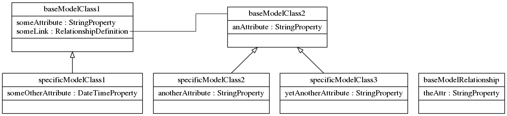

# Testing Neomodel inheritance

This repo contains a brief test that demonstrates the particular way that 
neomodel interprets inheritance.

# Prerequisites

1. A working neo4j installation on localhost
2. Usernames and passwords exported as the standard environment variables NEO4J_USERNAME, NEO4J_PASSWORD
3. A python3 virtualenvironment with the prerequisites that are described in the `requirements3.txt` file

# Overview

The project is composed of two files:

1. `src/models.py` sets up the schema
2. `src/main.py` demonstrates the way neomodel interprets the schema

# To test:

1. Activate the environment
2. Run `src/establishmodels.sh` to make sure that the labels are installed
3. Run `src/main.py` and observe the types of the objects that are reported under `someLink`

# The actual problem

Here is a class diagram generated by `pylint/pyreverse` of the schema that is established in 
`src/models.py`.

An association is established between `baseModelClass1` and `baseModelClass2` at the abstract level.

This association is "carried over" between `specificModelClass1` and `specificModelClass2, specificModelClass3`.

From a modeling point of view, either of `specificModelClass2, specificModelClass3` can be linked to `specificModelClass1` because 
they inherit from the same class.

This behaviour works during creation and serialisation of the objects but breaks during recall.

Specifically, when recalling objects from `specificModelClass1.someLink`, these are instantiated to their Abstract model specification
which was `baseModelClass2`.

